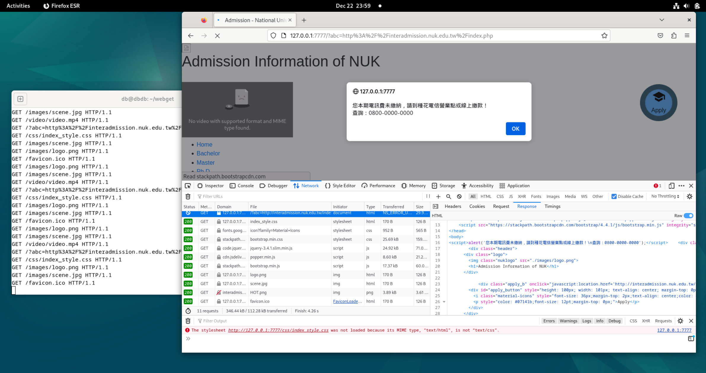

# WebProxy
C語言Web代理

## 功能
`./proxy.out 8080`  
  
訪問 `http://ip:8080` 利用此代理來存取外部網頁(僅限使用http協定網頁)。  
使用者經過本代理存取html格式的內容時，當遇到關鍵字「<body」，就會在他的下一行添加一個js彈窗，提示使用者未繳電信費。  
如果目標網站無body標籤，或body標籤跟小於號之間有空格，那就不會彈出彈窗。  
  
測試用地址：~http://interadmission.nuk.edu.tw/index.php~ 已強制跳轉HTTPS

## 運行截圖

